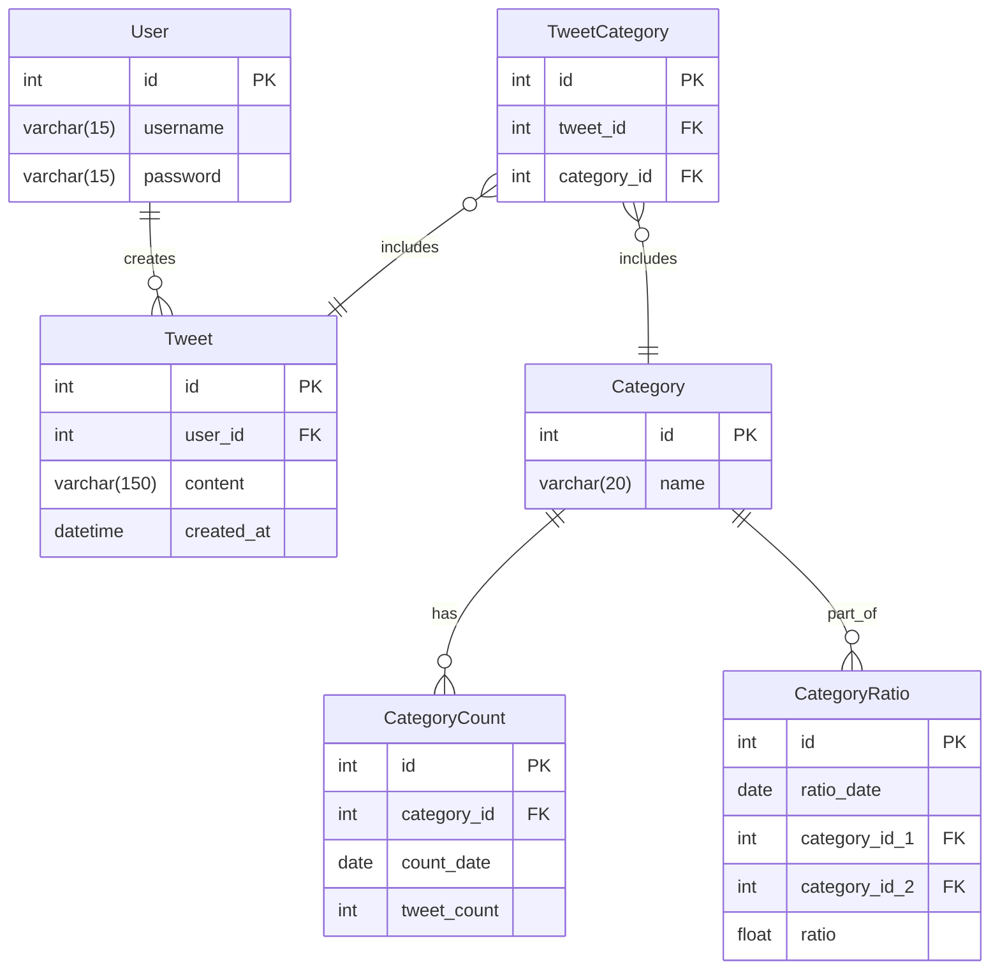

# Studi Analisis Pro-kontra Metode Dakwah Gus Miftah di Media Sosial

Proyek ini dibuat untuk memenuhi tugas besar pembuatan proyek dalam mata kuliah Basis Data. Tujuan utama dari proyek ini adalah untuk mengubah data dari repositori penelitian kami (Google Sheets) ke dalam sistem basis data MySQL (MariaDB). Tabel tersebut merupakan tabel <i>unnormalized</i> yang akan kami ubah menjadi bentuk 3NF sebagai berikut:

## Instalasi

### Tanpa CSV
Gunakan MariaDB versi 11.8.0, disarankan untuk menggunakan WAMP daripada XAMPP karena banyaknya bug dan versi MariaDB yang lawas dari XAMPP. Ikuti petunjuk berikut:

Anda bisa mengeksekusi file install.sql di Terminal ketika MariaDB sedang berjalan.

Insert terlebih dahulu kategori yang Anda akan gunakan. Selanjutnya, Anda dapat meng-insert data satu per satu.

### Dengan CSV
Anda dapat mengonversikan file .csv ke dalam query SQL dengan menggunakan script sqlconverter.py, pastikan Anda memiliki Python versi terbaru.

Anda bisa mengeksekusi file install.sql di Terminal ketika MariaDB sedang berjalan. 

Buat terlebih dahulu kategori yang Anda akan gunakan. Gunakan perintah berikut untuk menggunakan script:
python3 sqlconverter.py <nama file>.csv <nama database> --category_id <sesuai data id dari tabel Category> -o <nama file>.sql